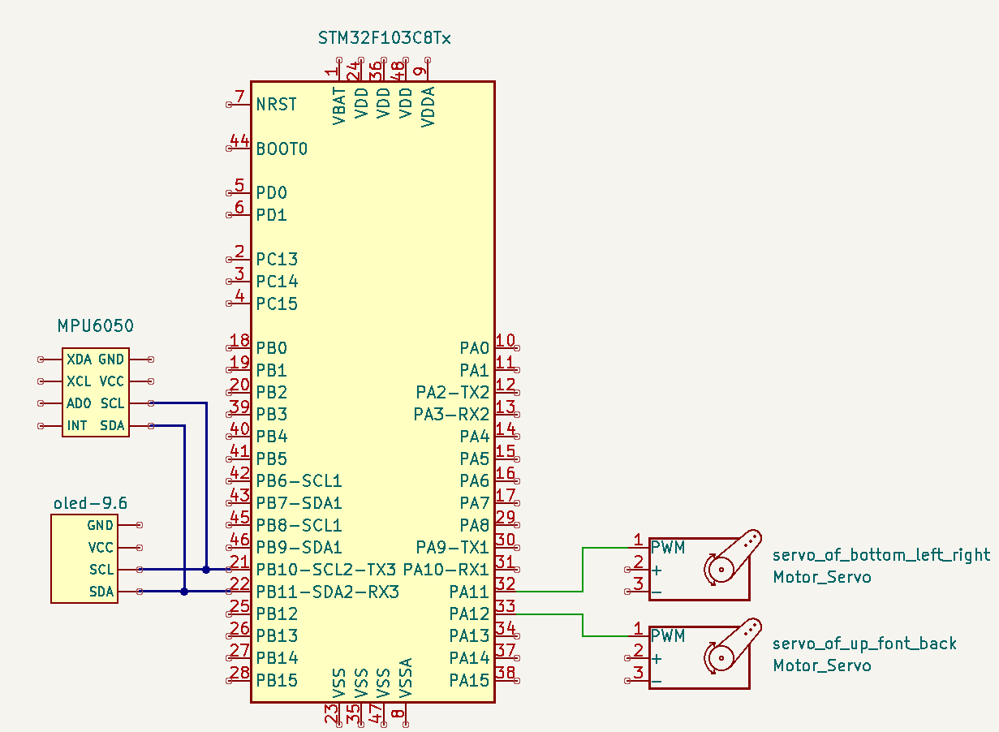
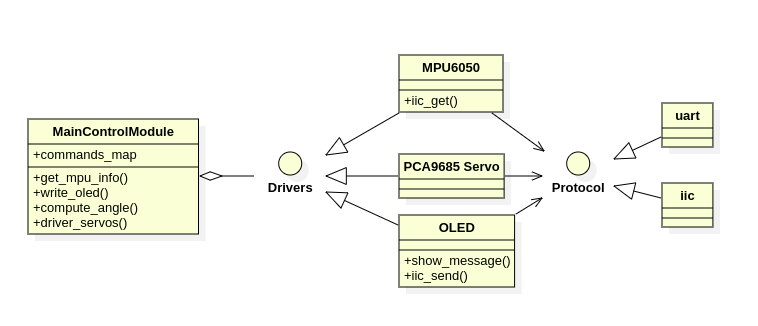
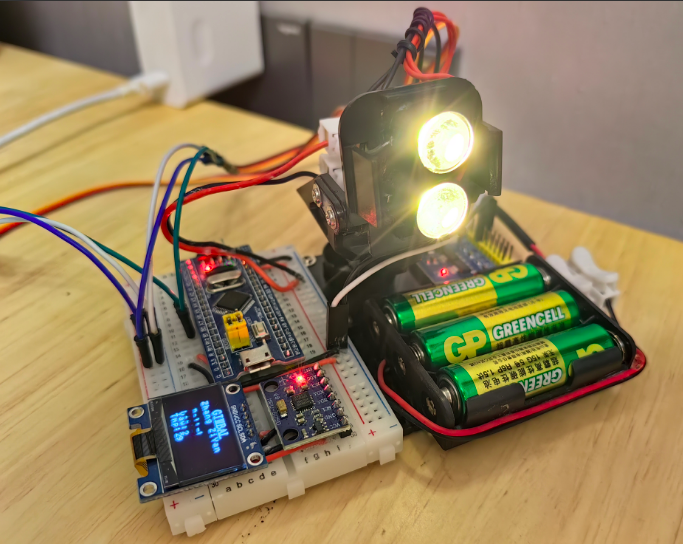

# Gimbal

Gimbal是通过MPU-6050控制的智能稳定照明灯。

## 设计说明

#### 硬件架构设计
- STM32F103C8T6中控。
- MPU-6050陀螺仪。
- OLED 0.96寸屏。
- 二自由度舵机云台。

详细参照：[硬件设计说明](hardware/README.md)

#### 软件架构设计
- STM32F103C8T6作为中控，连接MPU-6050，读取陀螺仪数据，计算当前云台X/Y/Z角偏移。
- 将陀螺仪数据展示到OLED屏。
- 计算陀螺仪偏移后反馈到二自由度云台，调整云台角度，实现稳定照明。

详细参照：[软件设计说明和代码](software/README.md)

## 成品效果

[视频:https://www.bilibili.com/video/BV1kMbXeJErE/](https://www.bilibili.com/video/BV1kMbXeJErE/)

# 参考致谢
[https://github.com/aixin698/stm32f1_mpu6050](https://github.com/aixin698/stm32f1_mpu6050)

[https://gitee.com/NackBT/mpu6050](https://gitee.com/NackBT/mpu6050)

[https://www.cnblogs.com/songmingze/p/17609666.html](https://www.cnblogs.com/songmingze/p/17609666.html)

[https://shequ.stmicroelectronics.cn/thread-639313-1-1.html](https://shequ.stmicroelectronics.cn/thread-639313-1-1.html)

[https://github.com/rpicopter/MotionSensorExample/tree/master](https://github.com/rpicopter/MotionSensorExample/tree/master)

[https://cloud.tencent.com/developer/article/1673718](https://cloud.tencent.com/developer/article/1673718)