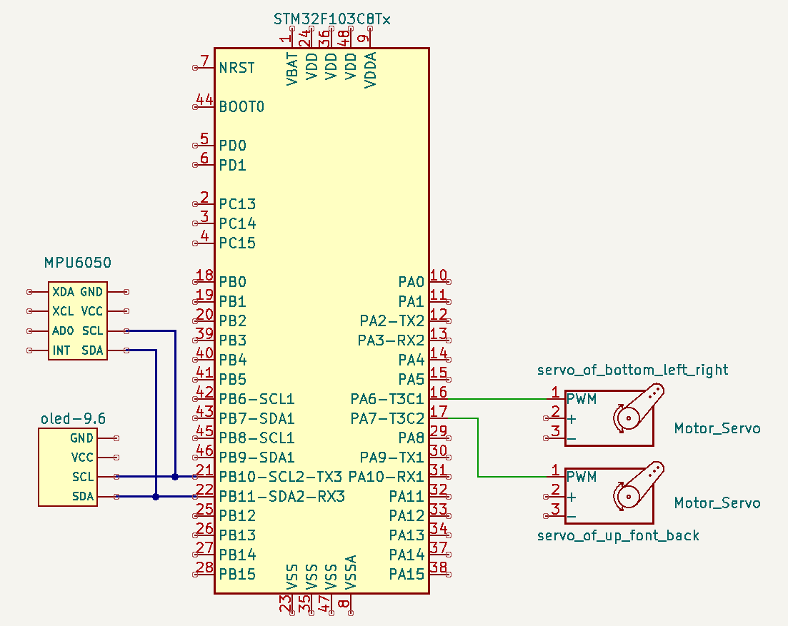
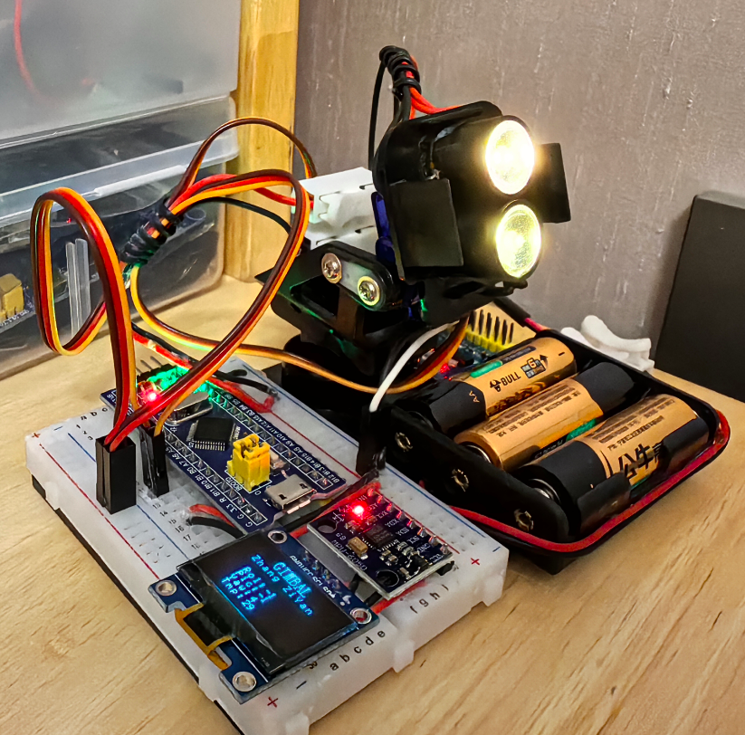

## 整体设计

## 组装效果

## 模块说明

#### 控制中心-STM32单板

STM32单板作为中心控制单元，读取陀螺仪数据，计算偏转角，反馈给云台舵机。

IO口分配如下：
| GPIO         | 对接口                  | 作用说明          |   指示灯|
| ------------ | ---------------------- | ---------------- | ------  |
| PA11         | 云台下方舵机控制          |  控制云台下方舵机  |         |
| PA12         | 云台上方舵机控制          |  控制云台上方舵机  |         |
| PB10         | IIC通信接舵机驱动 SCL2   |  舵机驱动通信      |         |
| PB11         | IIC通信接舵机驱动 SDA2   |  舵机驱动通信      |         |

#### 6轴陀螺仪

#### OLED显示屏

## 硬件设计工具KiCAD

安装：https://docs.kicad.org/5.1/zh/getting_started_in_kicad/getting_started_in_kicad.html