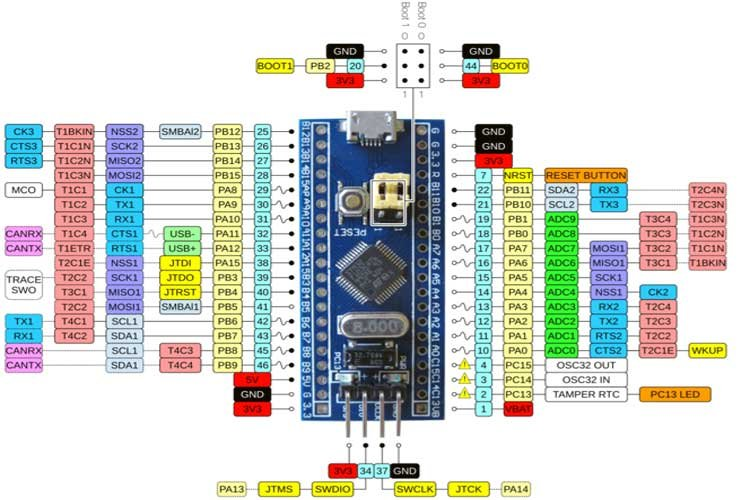

## 整体设计

## 组装效果

## 模块说明

#### 控制中心-STM32单板

STM32单板作为中心控制单元，读取陀螺仪数据，计算偏转角，反馈给云台舵机。

IO口分配如下：
| GPIO         | 对接口                  | 作用说明          |   指示灯|
| ------------ | ---------------------- | ---------------- | ------  |
| PA11         | 云台下方舵机控制          |  控制云台下方舵机  |         |
| PA12         | 云台上方舵机控制          |  控制云台上方舵机  |         |
| PB10         | IIC通信接舵机驱动 SCL2   |  舵机驱动通信      |         |
| PB11         | IIC通信接舵机驱动 SDA2   |  舵机驱动通信      |         |

#### 6轴陀螺仪

MPU6050基本功能

- 3轴陀螺仪
陀螺仪，测量的是绕xyz轴转动的角速度，对角速度积分可以得到角度。顺时针方向为正值。
- 3轴加速度计
加速度计，测量的是xyz方向受到的加速度。在静止时，测量到的是重力加速度，因此当物体倾斜时，根据重力的分力可以粗略的计算角度。在运动时，除了重力加速度，还叠加了由于运动产生的加速度。
- IIC通信
通过IIC方式与单片机进行数据传输，输出的是数字信号。另外还有另一个IIC接口，可以连接地磁传感器，从而实现9轴数据的融合。
关于IIC的基础知识：从IIC实测波形入手，搞懂IIC通信

#### OLED显示屏

## 硬件设计工具KiCAD

安装：https://docs.kicad.org/5.1/zh/getting_started_in_kicad/getting_started_in_kicad.html